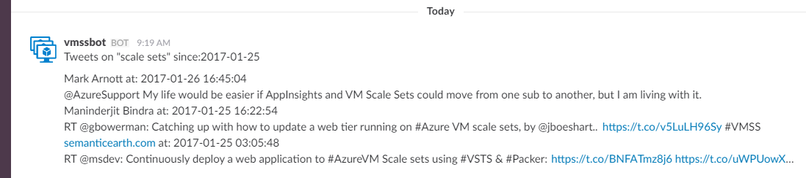

# Twitter/social media tool repo

Tools to search Twitter posts and other social media forums and share highlights, e.g. to a Slack channel.

## twit-report.py

This tool is designed to be scheduled to run daily, and sends a Twitter summary of one or more Twitter search results to a Slack channel. A basic version is shown below. 

To use, rename the twitconfig.json.tmpl file to twitconfig.json and update it with specific details for your Twitter API keys, Slack webhook, and a slack user name and icon reference. The Slack user name does not have to exist as the tool is designed to use an anonymous webhook.

To dos for for this tool:

- Add capability to search additional forums (e.g. Reddit, Stack Overflow) in order to create a single digest. 
- Add support for additional reporting destinations (e.g. email, Microsoft Teams, Twitter?)
