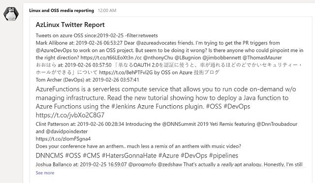
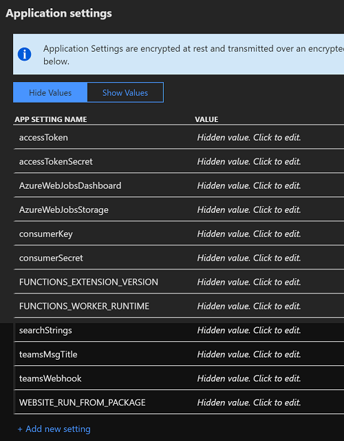
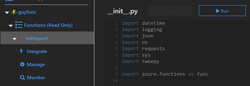

# Social media reporter for Teams

This Python-based Twitter search tool can be triggered as an Azure Function using a daily Timer Trigger, and post its output to a Microsoft Teams channel webhook. You can use it to implement a daily search for social media mentions of specific topics and report them to a messaging channel. This pattern can easily be adapted to perform other scheduled tasks, and send messages to other webhooks (like Slack for example).



## Advantages of running as a schedule-based Azure Function

This code uses an Azure Function `TimerTrigger`, which makes it easy to execute functions on a schedule.

- __Reliability__ and __maintainability__: A scheduled task running on a physical machine at a fixed time or the next time it was started has a single point of failure. A _serverless_ task has no infrastructure dependency.

- __Security__: Instead of using a config file to store Twitter credentials, webhooks and search strings, they can be stored securely as app settings configurable/updateable in the Azure Portal.

## Setup instructions

Note: If you are unsure of the  pre-requisites for creating an Azure Function, first refer to [Create your first Python function in Azure](https://docs.microsoft.com/azure/azure-functions/functions-create-first-function-python).

1. Create an Azure functions project using [Azure Functions Core Tools](https://docs.microsoft.com/azure/azure-functions/functions-run-local#v2), or [Azure Functions for Visual Studio Code](https://marketplace.visualstudio.com/items?itemName=ms-azuretools.vscode-azurefunctions) extension. Select Python as the language.

2. Create a new function, and select _Timer trigger_ as the function trigger.

3. In the function folder, edit the _function.json_ file to set the timer trigger settings (using crontab syntax). The following example sets the trigger to run the script file \_\_init\_\_.py daily at 8am UST:
    ```
    {
    "scriptFile": "__init__.py",
    "bindings": [
        {
        "name": "mytimer",
        "type": "timerTrigger",
        "direction": "in",
        "schedule": "0 0 8 * * *"
        }
    ]
    }
    ```

4. Using the \_\_init\_\_.py and requirements.txt files from this repo,  overwrite the corresponding stub files that were created for your function.

5. Publish your function to Azure. Note: It will not be ready to run until you set the required application settings listed below.

## App settings configured in Azure Portal



To access Twitter from an application you need a Twitter API key and access token, as well as a consumer API key and consumer secret. For an example of how to create these see [HOW TO GENERATE API KEY, CONSUMER TOKEN, ACCESS KEY FOR TWITTER OAUTH](http://www.spardadesign.com/how-to-generate-api-key-consumer-token-access-key-for-twitter-oauth/).

To post to a Microsoft Teams channel you need to create an incoming webhook. For example refer to: [Using Incoming Webhooks in Microsoft Teams](http://itcloudpro.net/2017/09/29/office-365-using-incoming-webhooks-in-microsoft-teams/).

Set the following app settings in the Azure Portal (you'll find Application settings under the heading "Configured features" when you click on the function project name). Once set, the application settings will appear as environment variables to the Python code:

### Access settings for Tweepy
- accessToken - Twitter accessToken
- accessTokenSecret - Twitter token secret
- consumerKey - Twitter consumer key
- consumerSecret - Twitter consumer secret

### Twitter search settings
- searchStrings - Search strings for Twitter query e.g. ["azure+linux", "azure+OSS", "azure+%22red+hat%22"]

### Microsoft Teams webhook settings
- teamsMsgTitle - Message title for Teams message
- teamsWebhook - webhook for specific Teams channel.

Once the app settings are set, you can test the function by running it from the portal. Select the function name and click the _Run_ button.

